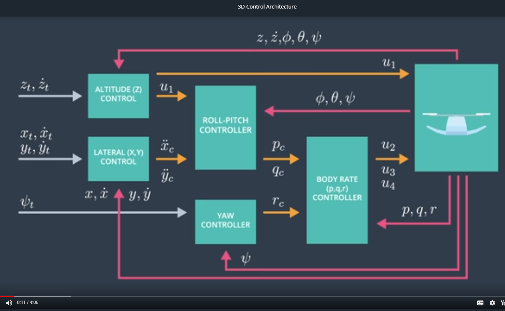

# FCND-Term1-P3-3D-Quadrotor-Controller
Udacity Flying Car Nanodegree - Term 1 - Project 3 - 3D Quadrotor Controller

### 1. Project Overview
Goal of this project is to design and build a 3D controller, which will control the quadrotors to fly the desired 3D trajectory in the simulator. 

The project is in two parts. First, We using the Python/Unity simulator environment for rapid prototyping of the desired controller architecture. 
Once it meet the requirements for a working controller, then we migrate that control architecture to a C++ project containing real vehicle code.
Finally, We test the C++ code controller with another simulator that udacity provided, provides a higher fidelity model of the real vehicle this code would be running on.

#### 1.1 3D Control Architecture




The 3D Control Architecture Diagram shows a cascade PID control system with 5 controllers, 4 actuator (u1 to u4) acting on two loop processes in series.

#### Trajectory Breakdown
On the left of the diagram, The trajectory gets split into three path, Path 1: Altitude or z part, Path 2: Lateral Position or x and y part,  Path 3: Yaw. The z trajectory is handled by the altitude controller, which generate the collective thrust (u1). The x and y trajectory is first handled by the lateral position controller, which outputs acceleration targets of x and y direction. 
Finally, the yaw trajectory is handled by the yaw controller.

#### Detils of each path
Path 1: Altitude 
The altitude controller is responsible for ensuring the vehicle stays close to target position and velocity by computing a target thrust value (u1).
The inputs to the altitude controller including everything related to the target and actual altitude, plus the current estimated attitude. Output of the altitude controller gets send to the roll-pitch controller, because the current commanded thrust is going to be shared in the x,y and z directions, and the portion that points in the x and y will 
determine acceleration in those directions. The other input of the roll-pitch controller comes from the lateral position controller.

Path 2: Lateral Position
The lateral position controller is just a PD controller in the 2D, It generate an acceleration command in the x and y directions, which is send to the roll-pitch controller. The complicated angular control logic in the roll-pitch controller. This roll-pitch controller is the most interesting of all of them. it's job is to take a thrust command as well as the desired x and y accelerations and attitude pitch, roll, yaw and p, q, r.
and output a target roll and pitch rate. These commanded  p and q values are send to the body rate controller. The body rate controller is just the P controller that convert p, q and r command into three rotational moment commands u2, u3 and u4. The r commands come from the yaw controller.

Path 3: Yaw
The yaw controller is controlled through the reactive moment command and that command only affects yaw.


### 2. Project Rubric 

#### 2.1 Implemented Controller 

##### 2.1.1 Implement body rate control in python and C++

The body rate control is a P controller on body rates to commanded moments. Steps of body rate control as follows,
```python
        compute current body rate error in all direction (r, p and q)
        compute angular acceleration 
        generate the rotational moment
		constrain the desired moment within a set of bounds (-MAX_TORQUE, MAX_TORQUE)
```

- python: lines 165 to 178 in controller.py
- C++: lines 97 to 117 in QuadControl.cpp

##### 2.1.2  Implement roll pitch control 
The roll-pitch control is also a P controller in the body frame, Which is to take a thrust command as well as the desired x and y accelerations and attitude pitch, roll, yaw and p, q, r. and output a target roll and pitch rate.
Steps of roll-pitch control as follows,

```python

        get collective acceleration: c = -thrust_cmd / DRONE_MASS
        actual portion of acceleration on x and y direction from rotation matrix
        target portion of acceleration on x, y and z direction: b_c = acceleration_cmd / c
        compute current position error of b term:  b_err = b_c - b
        compute target change rate of b term: b_dot_c = self.k_p_euler_angles[:2][::-1] * b_err
        r = np.array([[R[1, 0], -R[0, 0]],
                      [R[1, 1], -R[0, 1]]],
                     dtype=np.float)
        generate the target roll and pitch rate with matrix multiplication: pq_c = np.dot(r, b_dot_c) / R[2, 2]

```
- python: lines 138 to 164 in controller.py
- C++: lines 125 to 168 in QuadControl.cpp

##### 2.1.3 Implement altitude control 
Steps of altitude control as follows,
```python
        get actual b term on z direction from rotation matrix
        compute current position error in z direction
        compute current vertical error in z direction
        compute target acceleration in z direction
		generate the thrust command 
		constrain the thrust command within a set of bounds (0.1, MAX_THRUST)
```
- python: lines 113 to 136 in controller.py
- C++: lines 170 to 207 in QuadControl.cpp

##### 2.1.4 Implement lateral position control
Steps of lateral position control as follows,
```python
        compute current position error in all direction in world frame
        compute current velocity error in all direction in world frame	
		generate the target acceleration command 
		constrain thetarget acceleration within a set of bounds (-maxAccelXY, maxAccelXY)
```
- python: lines 94 to 110 in controller.py
- C++: lines 210 to 251 in QuadControl.cpp

##### 2.1.5 Implement yaw control 
Steps of yaw control as follows,
```python
        compute current yaw error
		generate the target yaw rate command
```
- python: lines 181 to 198 in controller.py
- C++: lines 255 to 274 in QuadControl.cpp


#### 2.2 Flight Evaluation
##### 2.2.1 Flight In Python   

##### 2.2.2 Flight In C++

##### Scenario 1
##### Scenario 2
##### Scenario 3
##### Scenario 4
##### Scenario 5


